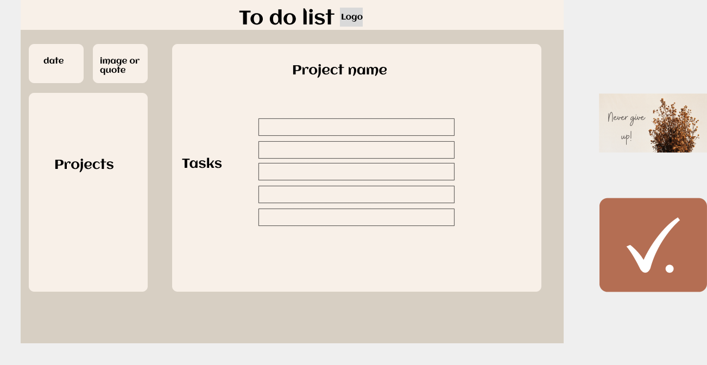

# TO DO LIST

## Introduction
To do list, where you can make new projects, edit or delete them. Each project has an array that can contain tasks. 

Tasks have title, notes, due date and priority. You can also make, edit or delete tasks. 

Tasks get sorted based on the day, week, all tasks and the important one.

This project was based on MVC - model, view, controller - where I learned how to separate logic from view. 

It contains CRUD operations - create, read, update, delete.
I used factory functions and model pattern. 

I learned how to implement and use local storage. Since i added objects with methods to it, I had to re-write those objects once i retrieved them from the local storage.

I made the design in figma first and added styles to css. The whole page is responsive. I made the logo and added quote to image.

This project was also made with webpack and I used date-fns library to easier find tasks for the coming week.

It has definitely been challenging project, but I learned a lot and would still make more improvements in the future. One would be be make an option of signing in, connecting the calendar, maybe new quote for every day. 

Design: 

## Technologies
Skills I used: 
- HTML
- CSS
- JavaScript
- Webpack

## Source
This project is based on the odin project bootcamp, I followed the instructions, but the logic of the implementation and the design are both mine. 
https://www.theodinproject.com/lessons/node-path-javascript-todo-list